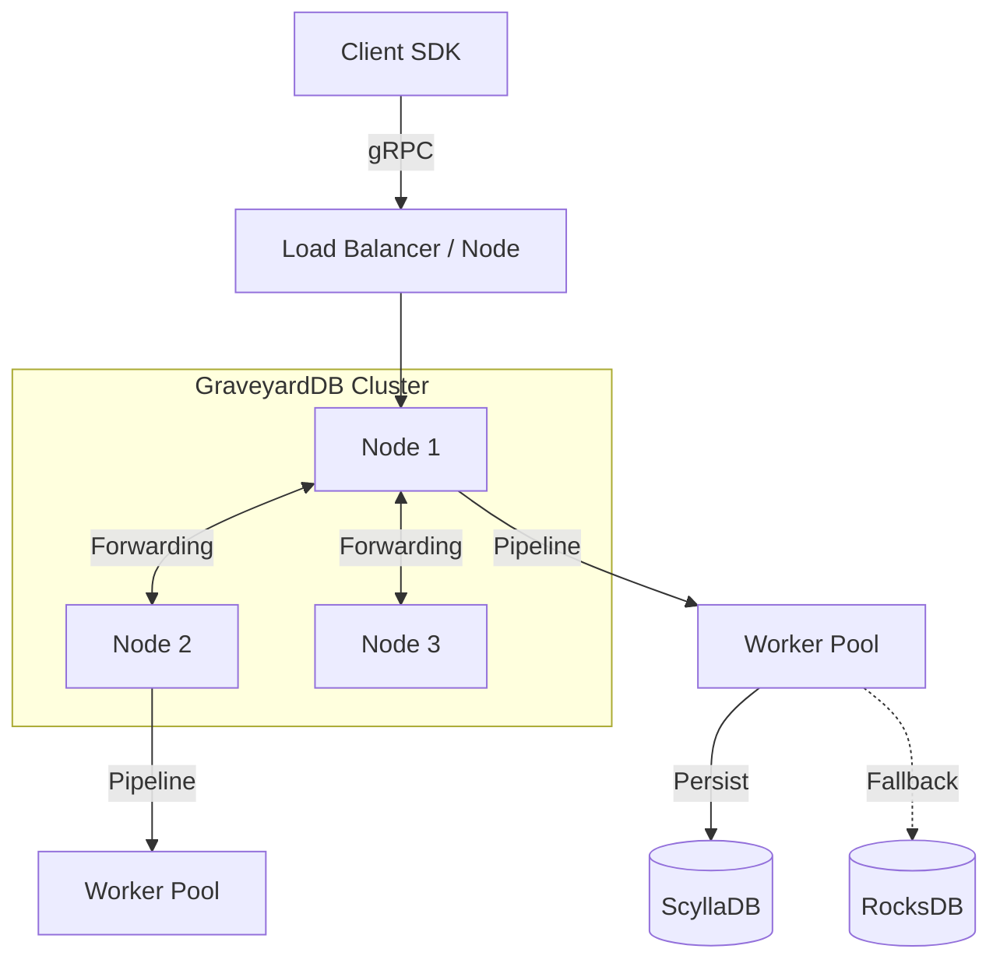

<div align="center">

# 🪦 graveyardB

**Use Boring Technology to Build Exciting Things.**

[](https://www.rust-lang.org/)
[](https://www.scylladb.com/)
[](https://opensource.org/licenses/MIT)

*A rock-solid, distributed, high-performance Event Store designed for the next generation of event-driven architectures.*

[Features](#-features) • [Architecture](#-architecture) • [Getting Started](#-getting-started) • [Clustering](#-clustering) • [Roadmap](#-roadmap)

</div>

---

## 🚀 Overview

**graveyardB** isn't just another database; it's a fortress for your events. Built on the shoulders of giants—**ScyllaDB** for infinite scalability and **RocksDB** for blazing-fast local persistence—it provides a unified, strongly-typed event sourcing platform.

We believe that **boring storage** (proven, reliable) combined with **exciting architecture** (actor models, distributed hashing) creates the perfect foundation for mission-critical systems.

## ✨ Features

- **🛡️ Rock-Solid Reliability**: Hybrid storage engine using ScyllaDB (Primary) and RocksDB (Local Fallback).
- **⚡ Blazing Fast**: 
    - **Internal Worker Pool**: 32+ generic workers using an actor-like model for lock-free sequential stream processing.
    - **Zero-Copy**: Optimized buffers layout.
- **🌐 Distributed Clustering**: 
    - **Consistent Hashing**: Streams are automatically sharded across the cluster.
    - **Smart Forwarding**: Nodes automatically route requests to the stream owner.
- **📜 Schema Governance**: 
    - **Protobuf Contracts**: Define your domain events once, generate code everywhere.
    - **Immutable History**: Schema changes are recorded as events (`$schema` streams).
- **🧠 Polyglot SDKs**: First-class support for **Java**, **Go**, and **TypeScript**.

## 🏗 Architecture



### The Pipeline
Requests enter a **Non-Blocking gRPC Layer** and are passed to the **EventPipeline**.
1. **Routing**: `NodeSelector` determines if the stream belongs to this node.
2. **Sharding**: If local, `hash(stream_id)` assigns it to a specific **Worker**.
3. **Execution**: The Worker processes the stream sequentially, ensuring **Optimistic Concurrency Control** without database locks.

## ⚡ Performance

| Metric | Result | Environment |
|--------|--------|-------------|
| **Throughput** | **~3,128 events/sec** | Single Node (RocksDB), 50 Concurrent Workers |
| **Latency** | < 1ms (avg) | Localhost |

*Benchmark run on `t3.medium` equivalent (local development mode).*

## 🛠 Getting Started

### Prerequisites
- Rust (latest stable)
- Docker (for ScyllaDB)

### Quick Start

1. **Spin up the Infrastructure**:
   ```bash
   docker-compose up -d
   ```
   *This starts a 2-node GraveyardDB cluster and a ScyllaDB node.*

2. **Run the Server (Manual)**:
   ```bash
   # Single node dev mode
   SCYLLA_URI=127.0.0.1:9042 SCYLLA_KEYSPACE=graveyard cargo run
   ```

3. **Run Stress Test**:
   ```bash
   cargo run --bin stress_test
   ```

## 📦 SDKs

| Language | Status | Package |
|----------|--------|---------|
| **Java** | 🟢 Stable | `com.eventstore.client` |
| **Go**   | 🟡 Beta   | `github.com/riken127/graveyar_db/go` |
| **TS**   | 🟡 Beta   | `@graveyar_db/client` |

### Java Example
```java
@GraveyardEntity("user")
public class User {
    @GraveyardField(min=18)
    private int age;
}

// Automatic Schema Registration
client.upsertSchema(User.class);
```

## 🔮 Roadmap

Check out via [FUTURE_WORK.md](FUTURE_WORK.md).

- [ ] **Telemetry**: OpenTelemetry tracing (Coming soon).
- [ ] **Snapshotting**: Aggregate snapshots.
- [ ] **Projections**: Real-time read models.

---

<div align="center">
Built with ❤️ by the GraveyardDB Team
</div>
