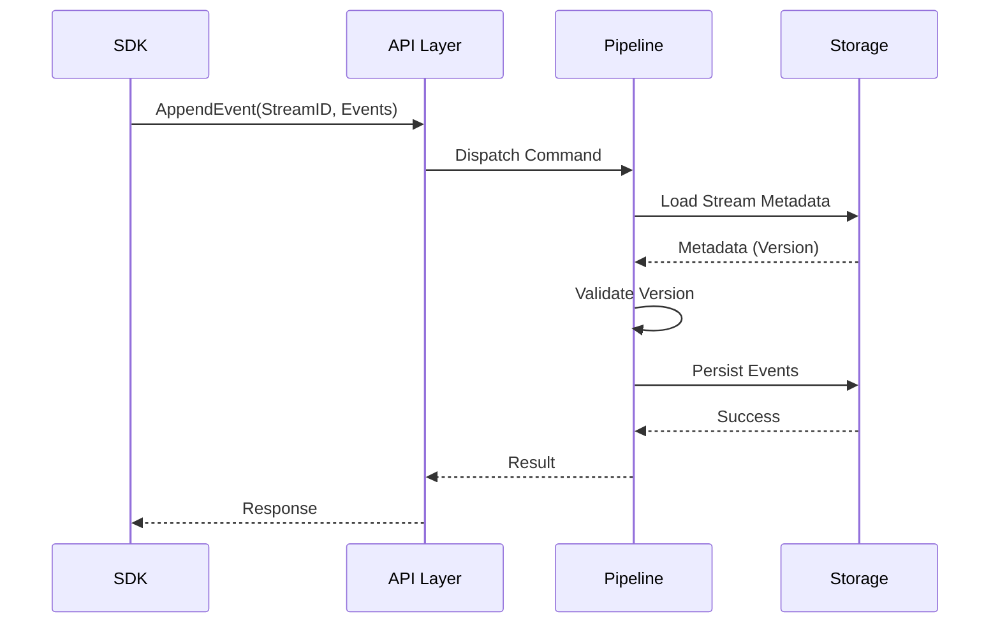

# Architecture

## Overview

`graveyar_db` follows a clean, layered architecture to separate concerns such as network communication, business logic, and data storage. This ensures maintainability and allows for pluggable components (like storage engines).

## System Context

The system interacts primarily with simple SDKs (Producers/Consumers) via gRPC.

```mermaid
graph LR
    User[SDK Application] -- gRPC --> System[graveyar_db]
    System -- Persists to --> Storage[Storage Engine\n(RocksDB/ScyllaDB)]
```

## Container Diagram

The application is divided into several logical modules ("containers" in the C4 sense, though they are Rust modules):

- **API Layer (`src/grpc`)**: Handles gRPC requests, deserialization, and basic validation.
- **Pipeline Layer (`src/pipeline`)**: The core business logic. Distributes requests, enforces concurrency rules, and manages the flow.
- **Domain Layer (`src/domain`)**: Contains core types, event definitions, and errors.
- **Storage Layer (`src/storage`)**: interacting with the underlying database.

```mermaid
graph TD
    subgraph "graveyar_db"
        API[API Module\n(gRPC)]
        Pipeline[Pipeline Module]
        Storage[Storage Interface]
        DB[(RocksDB / Scylla)]

        API -->|Commands| Pipeline
        Pipeline -->|Read/Write| Storage
        Storage -->|IO| DB
    end
```

## Data Flow

### Append Event

1. **SDK** sends `AppendEventRequest` (StreamID, Events, ExpectedVersion).
2. **API** converts proto message to Domain Event.
3. **Pipeline** verifies StreamID and ExpectedVersion.
4. **Storage** writes the event to the write-ahead log / database.
5. **Storage** updates the Stream's current version.
6. **API** returns success/failure to SDK.


